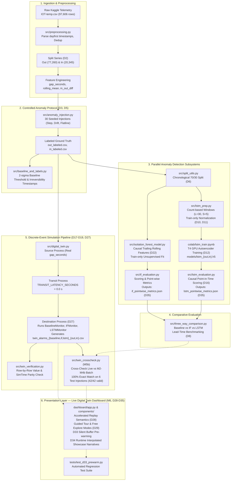
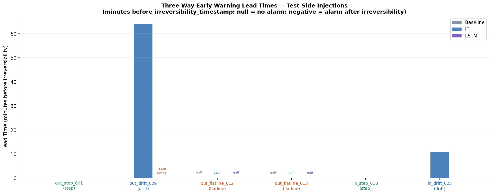
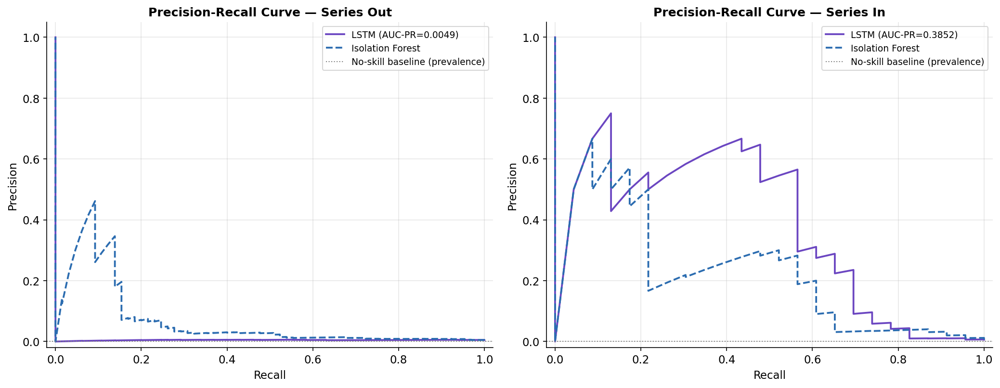

# Digital Twin-Based Early Warning System for Cold Chain Disruption Detection

[](https://coldchain-ews-twin.streamlit.app/)
[](https://www.python.org/)
[](https://pandas.pydata.org/)
[](https://numpy.org/)
[](https://scikit-learn.org/)
[](https://www.tensorflow.org/)
[](https://simpy.readthedocs.io/)
[](docs/Report/Krishna_Sikheriya_ColdChain_Report.pdf)
[](docs/AD_LOG.md)
[](tests/)

> **Quick Links:**
> - [Live Interactive Dashboard](https://coldchain-ews-twin.streamlit.app/)
> - [Full Academic Report (PDF)](docs/Report/Krishna_Sikheriya_ColdChain_Report.pdf)
> - [Plain-English Project Guide](docs/understand.md)
> - [Architectural Decision Log (D1–D35)](docs/AD_LOG.md)

---

> **Important: Structural Proxy Dataset Notice**  
> The dataset used in this project (`atulanandjha/temperature-readings-iot-devices` on Kaggle; file: `IOT-temp.csv`, 6.63 MB) is a **generic IoT temperature sensor log — it is not operational refrigerated-transport telemetry**. It is utilized exclusively as an experimental **structural proxy** to establish streaming ingestion pipelines, evaluate irregular sampling dynamics, and construct an end-to-end anomaly-detection architecture prior to deploying on proprietary cold-chain logistics telemetry. The dataset contains an invariant room identifier (`room_id/id = "Room Admin"` across all 97,605 unique records) and lacks physical spatial coordinates or geographic transit topology. Every derived threshold, synthetic perturbation, and performance metric is an engineering proxy construct and makes no food-safety, regulatory, or spoilage-kinetics claim. See `docs/AD_LOG.md` (decisions D1 through D35).

---

## Table of Contents

- [Core Research Questions and Findings at a Glance](#core-research-questions-and-findings-at-a-glance)
- [Problem Statement and Approach](#problem-statement-and-approach)
- [System Architecture](#system-architecture)
- [Repository Layout](#repository-layout)
- [Milestones and Implementation Status](#milestones-and-implementation-status)
- [Key Findings and Experimental Results](#key-findings-and-experimental-results)
  - [Telemetry Profile and Sampling Irregularity](#telemetry-profile-and-sampling-irregularity)
  - [Synthetic Injection Protocol](#synthetic-injection-protocol)
  - [Comparative Model Benchmark and Early Warning Lead Times](#comparative-model-benchmark-and-early-warning-lead-times)
  - [Point-Wise Classification Metrics (Single Source of Truth)](#point-wise-classification-metrics-single-source-of-truth)
  - [Digital Twin Replay & Live Cross-Check Parity](#digital-twin-replay--live-cross-check-parity)
- [Live Interactive Dashboard](#live-interactive-dashboard)
- [Quick-Start Guide](#quick-start-guide)
  - [1. Environment Setup](#1-environment-setup)
  - [2. Kaggle API Configuration](#2-kaggle-api-configuration)
  - [3. Pipeline Execution](#3-pipeline-execution)
  - [4. Automated Testing](#4-automated-testing)
- [Milestone 4a/4b Colab Workflow](#milestone-4a4b-colab-workflow)
- [Technology Stack](#technology-stack)
- [Project Context and Academic Citation](#project-context-and-academic-citation)

---

## Core Research Questions and Findings at a Glance

This project addresses **Topic 21: Digital Twin-Based Early Warning System for Cold Chain Disruption Detection Using Anomaly Detection**, investigating three core research questions:

| Research Question | Empirical Findings & Verdict | Resolution Details |
|---|---|---|
| **RQ1: Early-Warning Lead Time**<br>*Can an anomaly model embedded in a digital twin flag disruptions before failure becomes irreversible, and how early?* | **Category-Specific Early Warning:**<br>• **Drift Disruptions:** Isolation Forest achieved substantial early warnings of **+64.0 minutes** (`Out`) and **+11.0 minutes** (`In`) before irreversible failure.<br>• **Step Disruptions:** All models (Baseline, IF, LSTM) alarmed synchronously at $0.0$ min lead time; ML provides zero early-warning advantage for instantaneous breaches.<br>• **Flatlines:** Threshold baseline completely failed to detect frozen signals; Isolation Forest detected both variance collapses.<br>• **LSTM Lag:** The LSTM-Autoencoder was **late by 14.0 minutes** on `out_drift_009` due to gradual error adaptation. | Section [Lead Times](#comparative-model-benchmark-and-early-warning-lead-times)<br>Table 7.1 in Report |
| **RQ2: Classical vs. Deep Learning**<br>*How do classical tree-based ensembles compare against deep sequential autoencoders on irregular telemetry?* | **A Fundamental Precision/Recall Trade-off:**<br>• **Isolation Forest:** High recall (80.0% Out, 91.3% In), but high false-positive rate (45.6% Out, 27.0% In). Acts as an aggressive early tripwire.<br>• **LSTM-Autoencoder:** Precision-favouring and conservative on `In` series (Precision = 13.11%, FPR = 2.85%, AUC-PR = 0.3852), but struggled on `Out` series (AUC-PR = 0.0049). | Section [Point-Wise Metrics](#point-wise-classification-metrics-single-source-of-truth)<br>Table 7.2 in Report |
| **RQ3: Digital Twin Integration Fidelity**<br>*Does embedding detectors into an event-driven discrete-event simulation introduce silent divergence relative to batch evaluation?* | **100% Exact Live/Batch Parity:**<br>SimPy 3-stage digital twin replayed 97,603 readings in 6.03 s of CPU time ($>1.9$M$\times$ real time) with **$0.00 \times 10^0$ s timing discrepancy**. Across 30 injections $\times$ 3 monitors, all 42 applicable test evaluations matched batch results bit-for-bit (0 mismatches), verified via buffer pre-warming (D33). | Section [Replay Verification](#digital-twin-replay--live-cross-check-parity)<br>`twin_crosscheck_report.csv` |

---

## Problem Statement and Approach

### The Operational Challenge
Refrigerated supply chains ("cold chains") for perishable food, biologics, and pharmaceuticals require strict temperature adherence (e.g., 2 °C to 8 °C for vaccines). Undetected temperature excursions—caused by refrigeration compressor failures, power cuts, prolonged door openings, or sensor stiction—lead to massive inventory write-offs and public health hazards. 

Traditional monitoring architectures rely on **static upper-bound threshold alarms** (e.g., triggering only when a reading exceeds a fixed limit for a prolonged duration). By the time a static threshold alarm fires, cumulative thermal exposure has often already breached the critical stability point, rendering damage irreversible (post-hoc damage).

### The Hybrid Early Warning System
This repository implements a modular, reproducible Early Warning System (EWS) that couples discrete-event digital twin simulation with hybrid machine learning anomaly detection:

1. **Digital Twin Simulation Engine (`SimPy`):** Rather than assuming uniform fixed-interval sensor arrivals, the digital twin operates on an event-driven virtual clock driven by real historical inter-arrival gaps (`gap_seconds`). Telemetry streams through a 3-stage data pipeline abstraction (`Source -> Transit -> Destination`).
2. **Classical Isolation Forest Baseline (`scikit-learn`):** An unsupervised tree ensemble monitoring point-in-time multi-feature shifts (`temp_injected`, `gap_seconds`, and causal trailing rolling statistics `rolling_mean_if`, `rolling_std_if`).
3. **Deep Sequential Reconstruction (`TensorFlow / Keras`):** A bivariate LSTM-Autoencoder trained on normal operations to reconstruct sequential thermal patterns (`temp_injected`, `log1p(gap_seconds)`) over count-based sliding windows. Anomalies trigger spikes in reconstruction mean squared error (MSE).
4. **Early Warning Lead Time Formulation:** The primary operational metric is **lead time** ($\Delta t_{\text{lead}} = t_{\text{irreversibility}} - t_{\text{alarm}}$), defined as the time interval between when an anomaly detector triggers an alarm and when a sustained thermal excursion reaches the irreversible failure point. A positive lead time ($\Delta t > 0$) provides actionable runway for operators to execute corrective interventions before product loss occurs.

---

## System Architecture



---

## Repository Layout

```
coldchain-ews-twin/
├── .env                                # Local environment variable declarations
├── .gitignore                          # Excludes raw data, virtualenvs, local caches
├── README.md                           # Project documentation and architectural overview
├── requirements.txt                    # Project dependency specification
│
├── colab/
│   └── lstm_train.ipynb                # GPU training notebook with automated PAT GitHub push
│
├── dashboard/                          # Milestone 6 Streamlit presentation dashboard layer
│   ├── app.py                          # Presentation entry point & layout orchestrator
│   ├── constants.py                    # UI constants, display parameters & src/config imports
│   ├── data_loader.py                  # Cached metadata/stream loaders & D32 startup verification
│   ├── README.md                       # Comprehensive dashboard user guide & operating modes
│   ├── replay_engine.py                # D33 pre-warm simulation & active slice extraction
│   └── components/                     # Modular presentation components
│       ├── __init__.py                 # Component package marker
│       ├── alert_log.py                # Live streaming alert log table & multi-detector filters
│       ├── banners.py                  # D31 persistent proxy notice & train-side demo banners
│       ├── crosscheck_audit.py         # M5b verification audit table & protocol expander
│       ├── detector_cards.py           # Real-time telemetry bar & 3 detector metric cards
│       ├── showcase.py                 # D34 dynamic showcase captions & metrics row
│       └── telemetry_chart.py          # Interactive Altair streaming chart & score diagnostics
│
├── data/
│   ├── raw/                            # Directory for raw dataset (IOT-temp.csv; gitignored)
│   └── processed/                      # Evaluation summaries and processed artifacts
│       ├── if_evaluation.csv           # Isolation Forest point-wise and lead-time metrics
│       ├── if_pointwise_metrics.json   # D35 single-source-of-truth point-wise metrics (IF)
│       ├── if_pr_curve_in.csv          # Isolation Forest Precision-Recall coordinates (In series)
│       ├── if_pr_curve_out.csv         # Isolation Forest Precision-Recall coordinates (Out series)
│       ├── if_scores_in.csv            # Point-in-time Isolation Forest decision scores (In series)
│       ├── if_scores_out.csv           # Point-in-time Isolation Forest decision scores (Out series)
│       ├── in_features.csv             # Feature-engineered telemetry dataset (In series)
│       ├── in_labeled.csv              # Ground-truth labeled synthetic injection stream (In series)
│       ├── injection_evaluation_baseline.csv  # Baseline alarm and irreversibility timestamps
│       ├── injection_log.csv           # Ground-truth injection catalog (30 synthetic anomalies)
│       ├── injection_train_test_status.csv    # Chronological partition flags (train vs test)
│       ├── lstm_evaluation.csv         # LSTM point-wise metrics and lead times
│       ├── lstm_norm_stats_in.json     # Train-only z-score parameters (In series)
│       ├── lstm_norm_stats_out.json    # Train-only z-score parameters (Out series)
│       ├── lstm_pointwise_metrics.json # D35 single-source-of-truth point-wise metrics (LSTM)
│       ├── lstm_pr_curve_in.csv        # Precision-Recall curve coordinates (In series)
│       ├── lstm_pr_curve_out.csv       # Precision-Recall curve coordinates (Out series)
│       ├── lstm_training_log_in.json   # Colab GPU training history and loss logs (In series)
│       ├── lstm_training_log_out.json  # Colab GPU training history and loss logs (Out series)
│       ├── lstm_windows_in_train.npz   # Train window arrays for LSTM-Autoencoder (In series)
│       ├── lstm_windows_in_val.npz     # Validation window arrays for LSTM-Autoencoder (In series)
│       ├── lstm_windows_out_train.npz  # Train window arrays for LSTM-Autoencoder (Out series)
│       ├── lstm_windows_out_val.npz    # Validation window arrays for LSTM-Autoencoder (Out series)
│       ├── out_features.csv            # Feature-engineered telemetry dataset (Out series)
│       ├── out_labeled.csv             # Ground-truth labeled synthetic injection stream (Out series)
│       ├── three_way_comparison.csv    # Merged comparative benchmark (Baseline vs IF vs LSTM)
│       ├── twin_alarms_baseline_in.csv # Digital twin streaming alarms: Baseline (In series)
│       ├── twin_alarms_baseline_out.csv # Digital twin streaming alarms: Baseline (Out series)
│       ├── twin_alarms_if_in.csv       # Digital twin streaming alarms: Isolation Forest (In series)
│       ├── twin_alarms_if_out.csv      # Digital twin streaming alarms: Isolation Forest (Out series)
│       ├── twin_alarms_lstm_in.csv     # Digital twin streaming alarms: LSTM-Autoencoder (In series)
│       ├── twin_alarms_lstm_out.csv    # Digital twin streaming alarms: LSTM-Autoencoder (Out series)
│       ├── twin_crosscheck_report.csv  # Milestone 5b live vs batch cross-check audit report
│       ├── twin_replay_log_in.csv      # SimPy digital twin simulation log (In series)
│       └── twin_replay_log_out.csv     # SimPy digital twin simulation log (Out series)
│
├── docs/
│   ├── AD_LOG.md                       # Architecture Decision Log (decisions D1 through D35)
│   ├── data_profile.md                 # Quantitative EDA findings from Milestone 1
│   ├── Krishna_Sikheriya_Topic21_Synopsis.docx # Academic research synopsis
│   ├── understand.md                   # Comprehensive plain-English conceptual guide
│   ├── *.png                           # Publication figures and evaluation plots
│   └── Report/                         # Academic final report package
│       ├── Krishna_Sikheriya_ColdChain_Report.pdf  # Compiled full academic report
│       ├── Krishna_Sikheriya_ColdChain_Report.tex  # Complete LaTeX source (12 chapters)
│       ├── references.bib              # BibTeX literature citations
│       └── figures/                    # High-resolution report figures and IIITA logo
│
├── models/
│   ├── isolation_forest_in.joblib      # Trained Isolation Forest model (In series; tracked)
│   ├── isolation_forest_out.joblib     # Trained Isolation Forest model (Out series; tracked)
│   ├── lstm_in.h5                      # Trained LSTM-Autoencoder weights (In series; tracked)
│   └── lstm_out.h5                     # Trained LSTM-Autoencoder weights (Out series; tracked)
│
├── notebooks/
│   ├── 01_eda.ipynb                    # Milestone 1: Exploratory data analysis & sampling profile
│   ├── 02_preprocessing_and_labeling.ipynb # Milestone 2: Feature engineering & anomaly injection
│   ├── 03_isolation_forest.ipynb       # Milestone 3: Classical unsupervised baseline detector
│   ├── 04_lstm_evaluation.ipynb        # Milestone 4b: Deep reconstruction error & lead-time evaluation
│   ├── 05_digital_twin_replay.ipynb    # Milestone 5a: SimPy simulation replay & fidelity verification
│   └── 06_digital_twin_live_monitors.ipynb # Milestone 5b: Live streaming monitors & batch cross-check
│
├── src/
│   ├── anomaly_injection.py            # Controlled synthetic perturbation generator (D3)
│   ├── baseline_and_labels.py          # Naive 2-sigma threshold and irreversibility milestone (D4)
│   ├── config.py                       # Single source of truth for global constants (D1-D35)
│   ├── data_acquisition.py             # Authenticated Kaggle dataset download utility
│   ├── digital_twin.py                 # SimPy 3-stage event-driven replay engine (D17, D18)
│   ├── if_evaluation.py                # Point-wise and lead-time evaluation for Isolation Forest (D35)
│   ├── isolation_forest_model.py       # Trailing-feature recomputation and IF training (D7, D22)
│   ├── lstm_evaluation.py              # Causal sliding-window reconstruction scoring (D13, D16, D35)
│   ├── lstm_prep.py                    # Bivariate sliding-window extraction & normalization (D9-D11)
│   ├── preprocessing.py                # Timestamp parsing, deduplication, and initial features
│   ├── split_utils.py                  # Chronological train/test splitting utility (D6)
│   ├── three_way_comparison.py         # Comparative benchmark table and visualization synthesis
│   ├── twin_crosscheck.py              # Live vs batch cross-check audit & verification report (M5b)
│   ├── twin_monitors.py                # Online streaming monitors for Baseline, IF, LSTM (M5b, D27)
│   └── twin_verification.py            # Row-by-row simulation fidelity and SimTime validation
│
└── tests/
    └── test_d33_prewarm.py             # Automated D32 startup and D33 buffer pre-warm test suite
```

---

## Milestones and Implementation Status

| Milestone | Scope and Description | Primary Artifacts | Status |
|---|---|---|---|
| **Milestone 1** | Repository Scaffolding, Authenticated Acquisition & EDA | `src/data_acquisition.py`, `docs/data_profile.md`, `notebooks/01_eda.ipynb` | Completed |
| **Milestone 2** | Preprocessing, Causal Features, Anomaly Injection & Baseline | `src/preprocessing.py`, `src/anomaly_injection.py`, `src/baseline_and_labels.py` | Completed |
| **Milestone 3** | Classical Unsupervised Isolation Forest Baseline | `src/isolation_forest_model.py`, `src/if_evaluation.py`, `notebooks/03_isolation_forest.ipynb` | Completed |
| **Milestone 4a** | LSTM-Autoencoder Data Preparation & Colab Authoring | `src/lstm_prep.py`, `colab/lstm_train.ipynb`, `docs/AD_LOG.md` | Completed |
| **Milestone 4b** | Colab GPU Training, Causal Reconstruction & Comparative Evaluation | `src/lstm_evaluation.py`, `src/three_way_comparison.py`, `notebooks/04_lstm_evaluation.ipynb` | Completed |
| **Milestone 5a** | SimPy Discrete-Event Digital Twin Replay Engine (Skeleton) | `src/digital_twin.py`, `src/twin_verification.py`, `notebooks/05_digital_twin_replay.ipynb` | Completed |
| **Milestone 5b** | Integrated Digital Twin EWS with Online Anomaly Detectors | `src/twin_monitors.py`, `src/twin_crosscheck.py`, `notebooks/06_digital_twin_live_monitors.ipynb`, `data/processed/twin_crosscheck_report.csv` | Completed |
| **Milestone 6** | Streamlit Live Digital Twin Presentation Dashboard | `dashboard/app.py`, `dashboard/README.md`, `tests/test_d33_prewarm.py` | Completed |
| **Milestone 6.1** | Dashboard Bug Fixes & Material Symbols Icon Replacement | `dashboard/app.py` | Completed |
| **Milestone 6.2** | Remaining Truncation Fixes & Dashboard Metric/Table Audit | `dashboard/app.py` | Completed |
| **Milestone 6.3** | Timestamp Regression Fix & Modular Architecture Refactor | `dashboard/app.py`, `dashboard/constants.py`, `dashboard/data_loader.py`, `dashboard/replay_engine.py`, `dashboard/components/` | Completed |
| **Milestone 7** | Single-Source-of-Truth Serialization & Full Report Integration | `src/if_evaluation.py`, `src/lstm_evaluation.py`, `data/processed/*_pointwise_metrics.json`, `docs/Report/`, `docs/understand.md` | Completed |

---

## Key Findings and Experimental Results

### Telemetry Profile and Sampling Irregularity
Quantitative exploratory data analysis on the 97,606 raw records in `IOT-temp.csv` established the following baseline properties (see `docs/data_profile.md`):

- **Volume and Cleaning:** Exactly 1 exact duplicate row identified and removed, yielding 97,605 unique records.
- **Series Breakdown:** Binary `out/in` tag distribution shows 77,261 `"Out"` readings (79.16%) and 20,345 `"In"` readings (20.84%).
- **Parsing Correction:** Timestamp format is day-first (`DD-MM-YYYY HH:MM`). Parsing without `dayfirst=True` causes silent failure on 47,662 rows (48.83%) where day $> 12$. Day-first parsing yields 0 parse failures across a 133-day span (`2018-07-28 07:06` to `2018-12-08 09:30`).
- **Sampling Irregularity:** The inter-reading arrival gap exhibits severe dispersion:
  - Median gap: 0.0 seconds (71.40% of consecutive pairs share identical minute-resolution timestamps due to concurrent Out/In logging).
  - Mean gap: 117.82 seconds; Standard deviation: 5,446.3 seconds.
  - Coefficient of Variation ($\text{CoV} = \sigma / \mu$): **46.23** (quantitatively establishing extreme irregular arrival behaviour).
  - Outage Gaps: Maximum observed gap is 999,480.0 seconds (~11.57 days), indicating severe telemetry dropouts.

### Synthetic Injection Protocol
Because the proxy dataset contains no ground-truth disruption annotations, Milestone 2 implemented a controlled synthetic perturbation protocol (`src/anomaly_injection.py`, seeded RNG `seed=42`, D3):
- **30 Total Perturbations:** 15 injections in the Out series and 15 in the In series.
- **Three Fault Typologies:** 
  - *Step (Spike):* Sudden offset ($+5.0$ °C to $+15.0$ °C, duration 10–50 readings) representing abrupt thermal intrusion.
  - *Drift (Ramp):* Progressive linear drift ($+3.0$ °C to $+10.0$ °C, duration 30–120 readings) representing gradual cooling degradation.
  - *Flatline (Sensor Stiction):* Temperature variance frozen at current reading (duration 20–80 readings) representing hardware stiction.
- **Partitioning:** Chronological 70% train / 30% test split (`cutoff_ts = 2018-10-29 11:10:48`, D6) placed 24 injections in the training partition and 6 injections in the untouched test partition. Only the 6 test-side injections are used for performance claims (D26).

---

### Comparative Model Benchmark and Early Warning Lead Times
Test-side performance on the 6 evaluation injections was evaluated across three systems:
1. **Naive Baseline:** Static threshold set at train-period mean $+ 2.0\sigma$. Irreversibility defined as a sustained 10-minute exceedance (`D_IRREV_MINUTES = 10.0`, D4).
2. **Isolation Forest:** Unsupervised isolation ensemble fit on train-only data with `contamination='auto'` (scikit-learn default heuristic, untuned to strictly prevent test-label leakage, D7).
3. **LSTM-Autoencoder:** Causal last-timestep MSE reconstruction scoring (D16) evaluated against a train-only $2.0\sigma$ threshold (D13; Out threshold $= 1.0101$, In threshold $= 1.5128$).

Summary of early warning lead times ($\Delta t_{\text{lead}} = t_{\text{irreversibility}} - t_{\text{alarm}}$, in minutes) from `data/processed/three_way_comparison.csv`:

| Injection ID | Series | Fault Type | Baseline Alarm | IF Alarm | LSTM Alarm | Baseline Lead Time | IF Lead Time | LSTM Lead Time |
|---|---|---|---|---|---|---|---|---|
| `out_step_001` | Out | Step | `13:25` | `13:25` | `13:25` | 0.0 min | 0.0 min | 0.0 min |
| `out_drift_009` | Out | Drift | `03:03` | `01:59` | `03:17` | 0.0 min | **+64.0 min** | **-14.0 min (Late)** |
| `out_flatline_012` | Out | Flatline | None | `21:09` | `21:03` | Undefined | Alarm (No Irrev) | Alarm (No Irrev) |
| `out_flatline_013` | Out | Flatline | None | `01:22` | None | Undefined | Alarm (No Irrev) | Missed |
| `in_step_018` | In | Step | `17:14` | `17:14` | `17:14` | 0.0 min | 0.0 min | 0.0 min |
| `in_drift_023` | In | Drift | `08:07` | `07:56` | `08:07` | 0.0 min | **+11.0 min** | 0.0 min |



#### Comparative Lead-Time Insights
- **Step Excursions:** For abrupt large-magnitude spikes, all three models alarm concurrently at onset ($0.0$ min lead time before the 10-minute irreversibility threshold is reached). Machine learning provides zero early-warning runway when the anomaly is instantaneous.
- **Drift Excursions:** Isolation Forest provided decisive early warning (**+64.0 minutes** on `out_drift_009` and **+11.0 minutes** on `in_drift_023`), detecting the onset of anomalous variance well before the absolute temperature breached the baseline limit. Conversely, the LSTM-Autoencoder lagged on `out_drift_009`, alarming 14.0 minutes after irreversibility due to slow error accumulation across the linear ramp.
- **Flatline Excursions:** Static baseline thresholding fails entirely on frozen sensor signals that remain within normal temperature bounds. Isolation Forest successfully detected both flatline tests, while LSTM detected one of two.

---

### Point-Wise Classification Metrics (Single Source of Truth)

Point-wise confusion matrix counts and derived classification metrics are computed on the chronological test split (Out: 13,372 rows; In: 3,767 rows). To prevent transcription drift and single-source-of-truth violations, metrics are serialized directly to machine-readable JSON artifacts (`data/processed/if_pointwise_metrics.json` and `data/processed/lstm_pointwise_metrics.json`, D35) and guarded by an automated assertion: `assert tp + fn == int(y_true.sum())`.

| Metric | Isolation Forest — Out | LSTM-Autoencoder — Out | Isolation Forest — In | LSTM-Autoencoder — In |
|---|---|---|---|---|
| **Total Test Rows** | 13,372 | 13,372 | 3,767 | 3,767 |
| **Valid-Score Test Rows** | 13,372 | 13,343 | 3,767 | 3,738 |
| **Excluded (NaN Blind Spot)** | 0 | 29 | 0 | 29 |
| **True Anomaly Rows** | 65 | 65 | 23 | 23 |
| **True Positives (TP)** | 52 | 13 | 21 | 16 |
| **False Positives (FP)** | 6,067 | 2,722 | 1,010 | 106 |
| **True Negatives (TN)** | 7,240 | 10,556 | 2,734 | 3,609 |
| **False Negatives (FN)** | 13 | 52 | 2 | 7 |
| **Precision** | **0.0085 (0.85%)** | **0.0048 (0.48%)** | **0.0204 (2.04%)** | **0.1311 (13.11%)** |
| **Recall** | **0.8000 (80.00%)** | **0.2000 (20.00%)** | **0.9130 (91.30%)** | **0.6957 (69.57%)** |
| **F1 Score** | **0.0168** | **0.0093** | **0.0398** | **0.2207** |
| **False Positive Rate (FPR)** | **0.4559 (45.59%)** | **0.2050 (20.50%)** | **0.2698 (26.98%)** | **0.0285 (2.85%)** |
| **AUC-PR** | **0.0676** | **0.0049** | **0.2371** | **0.3852** |



#### Point-Wise Metric Analysis & Literature Context
1. **The Recall vs. Precision Trade-Off:** Isolation Forest acts as a high-sensitivity tripwire, capturing 80.0% to 91.3% of true anomaly points, but incurs a high false-positive rate (45.6% Out, 27.0% In). In contrast, the LSTM-Autoencoder on the `In` series is highly conservative, suppressing false alarms (FPR = 2.85%) and achieving a precision of 13.11% and an AUC-PR of 0.3852.
2. **Prevalence and Task Structure:** Domain-specific literature evaluating multi-sensor cold-chain fleets (e.g., Xie et al., 2025, *PLOS ONE*) reports F1 scores around 0.86 on real fleet telemetry. In our single-channel structural proxy, true anomalies represent only ~0.5% of total test rows (65 / 13,372). Under severe class imbalance, absolute point-wise precision and F1 are naturally suppressed, which is an expected consequence of honest, low-prevalence single-sensor injection rather than a model defect.
3. **Primary Metric Primacy:** In perishable logistics, **early-warning lead time ($\Delta t_{\text{lead}}$)** is the primary operational metric; point-wise metrics serve as secondary classifier diagnostics.

---

### Digital Twin Replay & Live Cross-Check Parity

Milestone 5a and 5b validated the SimPy discrete-event simulation engine (`src/digital_twin.py`) against raw labeled data:
- **Simulation Scale:** 77,259 events in Out series (133.10 days) and 20,344 events in In series (133.10 days).
- **Wall-Clock Runtime:** 6.03 seconds standard CPU execution (>1.9 million times faster than real time).
- **Parity Verification:** 0 value mismatches across all 97,603 rows; virtual clock discrepancy is **0.00e+00 seconds**.
- **Live vs. Batch Cross-Check (`twin_crosscheck_report.csv`):**
  - **42 applicable test evaluations:** **100% exact parity** (`match == True`, 0 mismatches) between live streaming monitors in SimPy and offline batch evaluations.
  - **48 training evaluations:** Correctly flagged as `not_applicable` (training preview only, D26).
  - **Cold-Start Buffer Pre-Warming (D33):** Priming rolling and sliding window buffers prior to the active replay window completely eliminates cold-start false negatives.

---

## Live Interactive Dashboard

The project includes an interactive, presentation-grade Streamlit web application deployed publicly on Streamlit Cloud:

[](https://coldchain-ews-twin.streamlit.app/)  
**Public URL:** [https://coldchain-ews-twin.streamlit.app/](https://coldchain-ews-twin.streamlit.app/)

```
┌─────────────────────────────────────────────────────────────────────────────┐
│ Cold Chain Disruption Early Warning System — Digital Twin                   │
│ Mode: [ Guided Tour (Viva Showcase) ]  │ Injection: out_drift_009 [TEST]    │
├─────────────────────────────────────────────────────────────────────────────┤
│ Replay: 2018-11-04 01:59:00 | 34.2 °C | Status: STREAMING (5x)              │
│ ┌──────────────────────┐ ┌──────────────────────┐ ┌──────────────────────┐  │
│ │ Fixed Baseline       │ │ Isolation Forest     │ │ LSTM-Autoencoder     │  │
│ │ Alarm: 03:03:00      │ │ Alarm: 01:59:00      │ │ Alarm: 03:17:00      │  │
│ │ Lead Time: 0.0 min   │ │ Lead Time: +64.0 min │ │ Lead Time: -14.0 min │  │
│ └──────────────────────┘ └──────────────────────┘ └──────────────────────┘  │
│ Real-Time Streaming Telemetry & Alarm Horizon Chart (Altair Declarative)     │
└─────────────────────────────────────────────────────────────────────────────┘
```

### Dashboard Operating Modes
1. **Guided Tour (Viva Showcase):** A curated 4-step sequence across out-of-sample test injections (`out_step_001`, `out_drift_009`, `out_flatline_013`, `in_drift_023`), dynamically interpolating verified detection metrics, alarm timestamps, and early warning lead times (D34).
2. **Free Explore (All 30 Injections):** Inspect all 30 synthetic anomalies across both series, featuring clear visual demarcation between out-of-sample test benchmarks (`[TEST]`) and training-region demonstration previews (`[TRAIN DEMO]`, D26, D31).

### Architectural Safeguards
- **Zero Logic Duplication (D27):** Re-uses verified detectors (`BaselineMonitor`, `IFMonitor`, `LSTMMonitor`) directly from `src/twin_monitors.py`.
- **Display-Only Accelerated Replay (D28):** Playback speed factors (`1x` to `Instant`) adjust UI pacing only and never alter telemetry values or timestamps passed to models.
- **Silent Buffer Pre-Warming (D33):** Pre-warms buffers with preceding readings, eliminating cold-start artifacts and guaranteeing exact live/batch match.
- **Pre-Flight Startup Verification (D32):** Halts gracefully with clear remediation instructions if required model or data artifacts are missing.

---

## Quick-Start Guide

### 1. Environment Setup
Clone the repository and initialize an isolated virtual environment using Python 3.11:

```bash
git clone https://github.com/Krishna200608/coldchain-ews-twin.git
cd coldchain-ews-twin

# Create virtual environment
py -3.11 -m venv .venv

# Activate environment
# Windows PowerShell:
.\.venv\Scripts\Activate.ps1
# macOS/Linux:
source .venv/bin/activate

# Upgrade pip and install dependencies
pip install --upgrade pip
pip install -r requirements.txt
```

### 2. Kaggle API Configuration
The raw dataset is acquired programmatically via the Kaggle API.

1. Navigate to <https://www.kaggle.com/settings> and click **Create New Token** under the API section.
2. Place the downloaded `kaggle.json` file in:
   - Windows: `C:\Users\<username>\.kaggle\kaggle.json`
   - Linux/macOS: `~/.kaggle/kaggle.json`
3. Secure permissions (POSIX): `chmod 600 ~/.kaggle/kaggle.json`

> **Security Note:** Never commit `kaggle.json` to source control. The repository `.gitignore` explicitly excludes `kaggle.json` and `.kaggle/`.

### 3. Pipeline Execution
To reproduce the full pipeline from raw ingestion through simulation verification and dashboard deployment:

```bash
# 1. Download raw telemetry to data/raw/IOT-temp.csv
python src/data_acquisition.py

# 2. Preprocess data and compute baseline within-series features
python src/preprocessing.py

# 3. Generate controlled synthetic anomaly injections
python src/anomaly_injection.py

# 4. Compute naive baseline threshold and failure irreversibility timestamps
python src/baseline_and_labels.py

# 5. Train Isolation Forest baseline and evaluate test lead times
python src/isolation_forest_model.py
python src/if_evaluation.py

# 6. Extract LSTM sliding windows and train-only normalization stats
python src/lstm_prep.py

# 7. Evaluate pre-trained LSTM weights (CPU inference)
python src/lstm_evaluation.py

# 8. Synthesize three-way comparative benchmark
python src/three_way_comparison.py

# 9. Execute SimPy digital twin replay engine and verify fidelity
python src/digital_twin.py
python src/twin_verification.py

# 10. Run online streaming monitors within discrete-event digital twin
python src/twin_monitors.py

# 11. Execute rigorous batch vs. live cross-check verification
python src/twin_crosscheck.py

# 12. Launch interactive Streamlit dashboard
streamlit run dashboard/app.py
```

### 4. Automated Testing
Run the regression test suite covering startup pre-flight checks and buffer pre-warming:

```bash
python -m unittest discover tests/ -v
```

---

## Milestone 4a/4b Colab Workflow

Because training the sequential LSTM-Autoencoder requires GPU acceleration, training is isolated to Google Colab (T4 GPU) while local development remains lightweight CPU-only.

### Step 1: Configure Colab Secret
1. Open [`colab/lstm_train.ipynb`](colab/lstm_train.ipynb) in Google Colab.
2. In the left panel, select the **Secrets** tab (key icon).
3. Add a secret named `GITHUB_TOKEN` containing a GitHub Personal Access Token (PAT) with `repo` contents write permissions. Enable **Notebook access**.
4. Set the runtime environment to **T4 GPU** (`Runtime -> Change runtime type -> T4 GPU`).

### Step 2: Automated Training and Remote Push
Execute all cells in `colab/lstm_train.ipynb`. The notebook automatically:
1. Clones the repository using the authenticated PAT.
2. Loads preprocessed training and validation window arrays directly from `data/processed/`.
3. Trains the D12 architecture with early stopping (`patience = 5`).
4. Generates loss curve figures and exports model weights (`models/lstm_{out,in}.h5`) and training logs (`data/processed/lstm_training_log_{out,in}.json`).
5. Commits and pushes the trained artifacts directly back to GitHub `main`.

### Step 3: Local Synchronization
After Colab execution completes, synchronize the newly pushed model weights to your local workspace:

```bash
git pull origin main
```

Proceed immediately with local CPU inference via `python src/lstm_evaluation.py`.

---

## Technology Stack

| Category | Technology | Purpose in Project |
|---|---|---|
| **Language** | Python 3.11 | Core runtime environment |
| **Simulation** | SimPy 4.1+ | Discrete-event digital twin replay engine with virtual clocks |
| **Machine Learning** | scikit-learn 1.3+ | Classical Isolation Forest unsupervised anomaly detector |
| **Deep Learning** | TensorFlow 2.15+ / Keras 3 | Sequential LSTM-Autoencoder architecture and CPU inference |
| **Interactive UI** | Streamlit 1.33+ | Live presentation-grade digital twin anomaly monitoring dashboard |
| **Interactive Viz** | Altair 5.0+ | Declarative streaming telemetry and alarm horizon charts |
| **Data Processing** | Pandas 2.0+, NumPy 1.26+ | Irregular time-series processing, windowing, and metrics |
| **Scientific Computing** | SciPy 1.12+ | Statistical distributions and metric calculations |
| **Visualization** | Matplotlib 3.8+, Seaborn 0.13+ | Precision-recall curves, reconstruction timelines, and lead-time plots |
| **Data Ingestion** | kagglehub, Kaggle CLI | Authenticated programmatic dataset acquisition |
| **Notebooks & Testing** | Jupyter, unittest (Standard Library), nbclient | Interactive analytical walkthroughs and automated regression tests |
| **Code Quality** | Ruff 0.4+ | Fast static linting and PEP 8 code formatting |

---

## Project Context and Academic Citation

### Academic Context
- **Project Topic:** Topic 21 — Digital Twin-Based Early Warning System for Cold Chain Disruption Detection Using Anomaly Detection
- **Author:** Krishna Sikheriya (Roll No: IIT2023139)
- **Course:** Managing Corporate Entrepreneurship (7th Semester B.Tech, IT)
- **Institution:** Indian Institute of Information Technology, Allahabad (IIITA)
- **Instructor / Supervisor:** Dr. Netranand Pathak
- **Target Academic Outlets:** *Computers in Industry* / *Journal of Food Engineering*

### BibTeX Citation
```bibtex
@techreport{sikheriya2026coldchain,
  author      = {Krishna Sikheriya},
  title       = {Digital Twin-Based Early Warning System for Cold Chain Disruption Detection Using Anomaly Detection},
  institution = {Indian Institute of Information Technology, Allahabad},
  year        = {2026},
  number      = {Topic 21},
  note        = {Managing Corporate Entrepreneurship Lab Assignment Report},
  url         = {https://github.com/Krishna200608/coldchain-ews-twin}
}
```

### License
This repository is an academic portfolio and research project. All rights reserved. Code and artifacts are provided for academic evaluation, peer review, and reproducibility inspection.
