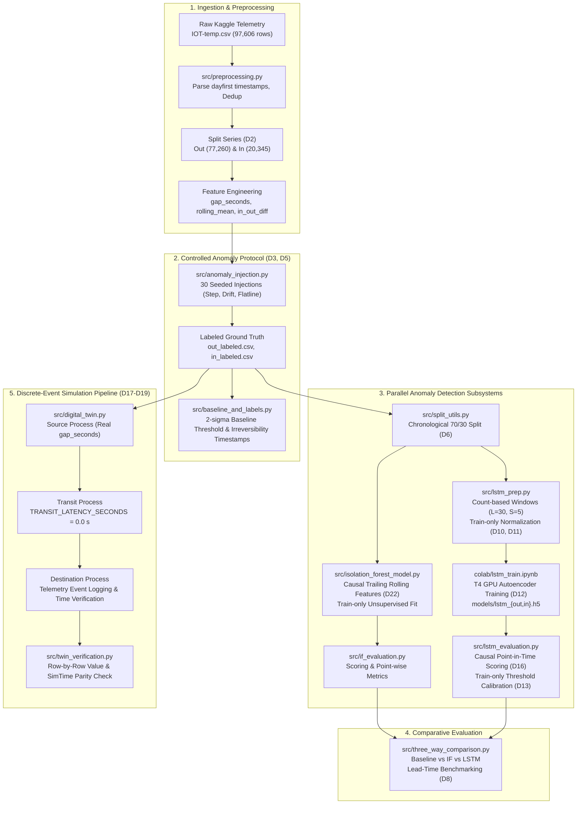

# Digital Twin-Based Early Warning System for Cold Chain Disruption Detection

[](https://www.python.org/)
[](https://pandas.pydata.org/)
[](https://numpy.org/)
[](https://scikit-learn.org/)
[](https://www.tensorflow.org/)
[](https://simpy.readthedocs.io/)
[](https://jupyter.org/)

> **Important: Structural Proxy Dataset Notice**  
> The dataset used in this project (`atulanandjha/temperature-readings-iot-devices` on Kaggle; file: `IOT-temp.csv`, 6.63 MB) is a **generic IoT temperature sensor log — it is not operational refrigerated-transport telemetry**. It is utilized exclusively as an experimental **structural proxy** to establish streaming ingestion pipelines, evaluate irregular sampling dynamics, and construct an end-to-end anomaly-detection architecture prior to deploying on proprietary cold-chain logistics telemetry. The dataset contains an invariant room identifier (`room_id/id = "Room Admin"` across all 97,605 unique records) and lacks physical spatial coordinates or geographic transit topology. Every derived threshold, synthetic perturbation, and performance metric is an engineering proxy construct and makes no food-safety, regulatory, or spoilage-kinetics claim. See `docs/AD_LOG.md` (decisions D1 through D19).

---

## Table of Contents

- [Problem Statement and Approach](#problem-statement-and-approach)
- [System Architecture](#system-architecture)
- [Repository Layout](#repository-layout)
- [Milestones and Implementation Status](#milestones-and-implementation-status)
- [Key Findings and Experimental Results](#key-findings-and-experimental-results)
  - [Telemetry Profile and Sampling Irregularity](#telemetry-profile-and-sampling-irregularity)
  - [Synthetic Injection Protocol](#synthetic-injection-protocol)
  - [Comparative Model Benchmark and Lead Times](#comparative-model-benchmark-and-lead-times)
  - [Digital Twin Replay Verification](#digital-twin-replay-verification)
- [Quick-Start Guide](#quick-start-guide)
  - [1. Environment Setup](#1-environment-setup)
  - [2. Kaggle API Configuration](#2-kaggle-api-configuration)
  - [3. Pipeline Execution](#3-pipeline-execution)
- [Milestone 4a/4b Colab Workflow](#milestone-4a4b-colab-workflow)
- [Technology Stack](#technology-stack)
- [Project Context and Hygiene](#project-context-and-hygiene)

---

## Problem Statement and Approach

### The Operational Challenge
Refrigerated supply chains ("cold chains") for perishable food products, biologics, and pharmaceuticals require continuous temperature control within specified regulatory bands (e.g., 2 °C to 8 °C for biopharmaceuticals). Undetected temperature excursions—caused by refrigeration mechanical failures, door seal deterioration, extended loading dwell times, or power interruptions—lead to rapid spoilage, inventory write-offs, and health hazards. 

Traditional monitoring architectures rely on static upper-bound threshold alarms (e.g., triggering when temperature exceeds a fixed limit for a prolonged duration). By the time a static threshold alarm sounds, cumulative thermal exposure has often already breached critical product stability thresholds, rendering damage irreversible.

### The Hybrid Early Warning System
This repository implements a modular, reproducible Early Warning System (EWS) that couples discrete-event digital twin simulation with hybrid machine learning anomaly detection:

1. **Digital Twin Simulation Engine (`SimPy`):** Rather than assuming uniform fixed-interval sensor arrivals, the digital twin operates on an event-driven virtual clock driven by real historical inter-arrival gaps (`gap_seconds`). Telemetry streams through a 3-stage data pipeline abstraction (`Source → Transit → Destination`).
2. **Classical Isolation Forest Baseline (`scikit-learn`):** An unsupervised tree ensemble monitoring point-in-time multi-feature shifts (`temp_injected`, `gap_seconds`, and causal trailing rolling statistics `rolling_mean_if`, `rolling_std_if`).
3. **Deep Sequential Reconstruction (`TensorFlow / Keras`):** A bivariate LSTM-Autoencoder trained on normal operations to reconstruct sequential thermal patterns (`temp_injected`, `log1p(gap_seconds)`) over count-based sliding windows. Anomalies trigger spikes in reconstruction mean squared error (MSE).
4. **Early Warning Lead Time Formulation:** The primary evaluation metric is **lead time** ($\Delta t_{\text{lead}} = t_{\text{irreversibility}} - t_{\text{alarm}}$), defined as the time interval between when an anomaly detector triggers an alarm and when a sustained thermal excursion reaches the irreversible failure point. A positive lead time ($\Delta t > 0$) provides actionable runway for operators to execute corrective interventions (e.g., auxiliary chilling, routing adjustment) before product loss occurs.

---

## System Architecture



---

## Repository Layout

```
coldchain-ews-twin/
├── .env                                # Local environment variable declarations
├── .gitignore                          # Excludes raw data, joblib models, virtualenvs
├── README.md                           # Project documentation and architectural overview
├── requirements.txt                    # Project dependency specification
│
├── colab/
│   └── lstm_train.ipynb                # GPU training notebook with automated PAT GitHub push
│
├── data/
│   ├── raw/                            # Directory for raw dataset (IOT-temp.csv; gitignored)
│   └── processed/                      # Evaluation summaries and processed artifacts
│       ├── if_evaluation.csv           # Isolation Forest point-wise and lead-time metrics
│       ├── injection_evaluation_baseline.csv  # Baseline alarm and irreversibility timestamps
│       ├── injection_log.csv           # Ground-truth injection catalog (30 synthetic anomalies)
│       ├── injection_train_test_status.csv    # Chronological partition flags (train vs test)
│       ├── lstm_evaluation.csv         # LSTM point-wise metrics and lead times
│       ├── lstm_norm_stats_in.json     # Train-only z-score parameters (In series)
│       ├── lstm_norm_stats_out.json    # Train-only z-score parameters (Out series)
│       ├── lstm_pr_curve_in.csv        # Precision-Recall curve coordinates (In series)
│       ├── lstm_pr_curve_out.csv       # Precision-Recall curve coordinates (Out series)
│       ├── lstm_training_log_in.json   # Colab GPU training history and loss logs (In series)
│       ├── lstm_training_log_out.json  # Colab GPU training history and loss logs (Out series)
│       ├── three_way_comparison.csv    # Merged comparative benchmark (Baseline vs IF vs LSTM)
│       ├── twin_replay_log_in.csv      # SimPy digital twin simulation log (In series)
│       └── twin_replay_log_out.csv     # SimPy digital twin simulation log (Out series)
│
├── docs/
│   ├── AD_LOG.md                       # Architecture Decision Log (decisions D1 through D19)
│   ├── data_profile.md                 # Quantitative EDA findings from Milestone 1
│   ├── Krishna_Sikheriya_Topic21_Synopsis.docx # Academic research synopsis
│   └── *.png                           # Generated publication figures and evaluation plots
│
├── models/
│   ├── isolation_forest_in.joblib      # Trained Isolation Forest model (In series; gitignored)
│   ├── isolation_forest_out.joblib     # Trained Isolation Forest model (Out series; gitignored)
│   ├── lstm_in.h5                      # Trained LSTM-Autoencoder weights (In series; tracked)
│   └── lstm_out.h5                     # Trained LSTM-Autoencoder weights (Out series; tracked)
│
├── notebooks/
│   ├── 01_eda.ipynb                    # Milestone 1: Exploratory data analysis & sampling profile
│   ├── 02_preprocessing_and_labeling.ipynb # Milestone 2: Feature engineering & anomaly injection
│   ├── 03_isolation_forest.ipynb       # Milestone 3: Classical unsupervised baseline detector
│   ├── 04_lstm_evaluation.ipynb        # Milestone 4b: Deep reconstruction error & lead-time evaluation
│   └── 05_digital_twin_replay.ipynb    # Milestone 5a: SimPy simulation replay & fidelity verification
│
└── src/
    ├── anomaly_injection.py            # Controlled synthetic perturbation generator (D3)
    ├── baseline_and_labels.py          # Naive 2-sigma threshold and irreversibility milestone (D4)
    ├── config.py                       # Single source of truth for global constants (D1-D19)
    ├── data_acquisition.py             # Authenticated Kaggle dataset download utility
    ├── digital_twin.py                 # SimPy 3-stage event-driven replay engine (D17, D18)
    ├── if_evaluation.py                # Point-wise and lead-time evaluation for Isolation Forest
    ├── isolation_forest_model.py       # Trailing-feature recomputation and IF training (D7, D22)
    ├── lstm_evaluation.py              # Causal sliding-window reconstruction scoring (D13, D16)
    ├── lstm_prep.py                    # Bivariate sliding-window extraction & normalization (D9-D11)
    ├── preprocessing.py                # Timestamp parsing, deduplication, and initial features
    ├── split_utils.py                  # Chronological train/test splitting utility (D6)
    ├── three_way_comparison.py         # Comparative benchmark table and visualization synthesis
    └── twin_verification.py            # Row-by-row simulation fidelity and SimTime validation
```

---

## Milestones and Implementation Status

| Milestone | Scope and Description | Primary Artifacts | Status |
|---|---|---|---|
| **Milestone 1** | Repository Scaffolding, Authenticated Acquisition & EDA | `src/data_acquisition.py`, `docs/data_profile.md`, `notebooks/01_eda.ipynb` | Completed |
| **Milestone 2** | Preprocessing, Causal Features, Anomaly Injection & Baseline | `src/preprocessing.py`, `src/anomaly_injection.py`, `src/baseline_and_labels.py` | Completed |
| **Milestone 3** | Classical Unsupervised Isolation Forest Baseline | `src/isolation_forest_model.py`, `src/if_evaluation.py`, `notebooks/03_isolation_forest.ipynb` | Completed |
| **Milestone 4a** | LSTM-Autoencoder Data Preparation & Colab Authoring | `src/lstm_prep.py`, `colab/lstm_train.ipynb`, `docs/AD_LOG.md` | Completed |
| **Milestone 4b** | Colab GPU Training, Causal Reconstruction & Comparative Evaluation | `src/lstm_evaluation.py`, `src/three_way_comparison.py`, `notebooks/04_lstm_evaluation.ipynb` | Completed |
| **Milestone 5a** | SimPy Discrete-Event Digital Twin Replay Engine (Skeleton) | `src/digital_twin.py`, `src/twin_verification.py`, `notebooks/05_digital_twin_replay.ipynb` | Completed |
| **Milestone 5b** | Integrated Digital Twin EWS with Online Anomaly Detectors | In-flight integration of live detectors into Destination process | Planned |

---

## Key Findings and Experimental Results

### Telemetry Profile and Sampling Irregularity
Quantitative exploratory data analysis on the 97,606 raw records in `IOT-temp.csv` established the following baseline properties (see `docs/data_profile.md`):

- **Volume and Cleaning:** Exactly 1 exact duplicate row identified and removed, yielding 97,605 unique records.
- **Series Breakdown:** Binary `out/in` tag distribution shows 77,261 `"Out"` readings (79.16%) and 20,345 `"In"` readings (20.84%).
- **Parsing Correction:** Timestamp format is day-first (`DD-MM-YYYY HH:MM`). Parsing without `dayfirst=True` causes silent failure on 47,662 rows (48.83%) where day $> 12$. Day-first parsing yields 0 parse failures across a 133-day span (`2018-07-28 07:06` to `2018-12-08 09:30`).
- **Sampling Irregularity:** The inter-reading arrival gap exhibits severe dispersion:
  - Median gap: 0.0 seconds (71.40% of consecutive pairs share identical minute-resolution timestamps due to concurrent Out/In logging).
  - Mean gap: 117.82 seconds; Standard deviation: 5,446.3 seconds.
  - Coefficient of Variation ($\text{CoV} = \sigma / \mu$): **46.23** (quantitatively establishing extreme irregular arrival behaviour).
  - Outage Gaps: Maximum observed gap is 999,480.0 seconds (~11.57 days), indicating severe telemetry dropouts.

### Synthetic Injection Protocol
Because the proxy dataset contains no ground-truth disruption annotations, Milestone 2 implemented a controlled synthetic perturbation protocol (`src/anomaly_injection.py`, seeded RNG `seed=42`, D3):
- **30 Total Perturbations:** 15 injections in the Out series and 15 in the In series.
- **Three Fault Typologies:** 
  - *Step (Spike):* Sudden offset ($+5.0$ °C to $+15.0$ °C, duration 10–50 readings) representing abrupt thermal intrusion.
  - *Drift (Ramp):* Progressive linear drift ($+3.0$ °C to $+10.0$ °C, duration 30–120 readings) representing gradual cooling degradation.
  - *Flatline (Sensor Stiction):* Temperature variance frozen at current reading (duration 20–80 readings) representing hardware stiction.
- **Partitioning:** Chronological 70% train / 30% test split (`cutoff_ts = 2018-10-29 11:10:48`, D6) placed 24 injections in the training partition and 6 injections in the untouched test partition.

### Comparative Model Benchmark and Lead Times
Test-side performance on the 6 evaluation injections was evaluated across three systems:
1. **Naive Baseline:** Static threshold set at train-period mean $+ 2.0\sigma$. Irreversibility defined as a sustained 10-minute exceedance (`D_IRREV_MINUTES = 10.0`, D4).
2. **Isolation Forest:** Unsupervised isolation ensemble fit on train-only data with contamination 0.01.
3. **LSTM-Autoencoder:** Causal last-timestep MSE reconstruction scoring (D16) evaluated against a train-only $2.0\sigma$ threshold (D13; Out threshold $= 1.0101$, In threshold $= 1.5128$).

Summary of early warning lead times ($\Delta t = t_{\text{irreversibility}} - t_{\text{alarm}}$, in minutes) from `data/processed/three_way_comparison.csv`:

| Injection ID | Series | Fault Type | Baseline Alarm | IF Alarm | LSTM Alarm | Baseline Lead Time | IF Lead Time | LSTM Lead Time |
|---|---|---|---|---|---|---|---|---|
| `out_step_001` | Out | Step | `13:25` | `13:25` | `13:25` | 0.0 min | 0.0 min | 0.0 min |
| `out_drift_009` | Out | Drift | `03:03` | `01:59` | `03:17` | 0.0 min | **+64.0 min** | **-14.0 min (Late)** |
| `out_flatline_012` | Out | Flatline | None | `21:09` | `21:03` | Undefined | Alarm (No Irrev) | Alarm (No Irrev) |
| `out_flatline_013` | Out | Flatline | None | `01:22` | None | Undefined | Alarm (No Irrev) | Missed |
| `in_step_018` | In | Step | `17:14` | `17:14` | `17:14` | 0.0 min | 0.0 min | 0.0 min |
| `in_drift_023` | In | Drift | `08:07` | `07:56` | `08:07` | 0.0 min | **+11.0 min** | 0.0 min |

#### Comparative Observations
- **Step Excursions:** For abrupt large-magnitude spikes, all three models alarm concurrently at onset ($0.0$ min lead time before the 10-minute irreversibility threshold is reached).
- **Drift Excursions:** Isolation Forest provided substantial early warning (+64.0 minutes on `out_drift_009` and +11.0 minutes on `in_drift_023`), detecting the onset of anomalous variance well before the absolute temperature breached the baseline limit. Conversely, the LSTM-Autoencoder lagged on `out_drift_009`, alarming 14 minutes after irreversibility due to slow error accumulation across the linear ramp.
- **Flatline Excursions:** Static baseline thresholding fails entirely on frozen sensor signals that remain within normal bounds. Isolation Forest successfully detected both flatline tests, while LSTM detected one of two.

### Digital Twin Replay Verification
Milestone 5a validated the SimPy discrete-event simulation engine (`src/digital_twin.py`) against raw labeled data (`src/twin_verification.py`):
- **Simulation Scale:** 77,259 events in Out series (simulating 133.098 days) and 20,344 events in In series (simulating 133.100 days).
- **Wall-Clock Runtime:** 6.03 seconds on standard CPU execution (>1.9 million times faster than real time).
- **Parity Verification:** 
  - Row count match: 100% exact parity (77,259 / 77,259 and 20,344 / 20,344).
  - Reading attribute match (`temp_injected`, `is_injected_anomaly`, `injection_type`): Exactly 0 mismatches across all 97,603 rows.
  - Virtual clock consistency ($\max |\Delta t_{\text{sim}} - \Delta t_{\text{real}}|$): **0.00e+00 seconds** maximum discrepancy, confirming zero timing drift across 133 days of simulated time.

---

## Quick-Start Guide

### 1. Environment Setup
Clone the repository and initialize an isolated virtual environment using Python 3.11:

```bash
git clone https://github.com/Krishna200608/coldchain-ews-twin.git
cd coldchain-ews-twin

# Create virtual environment
py -3.11 -m venv .venv

# Activate environment
# Windows PowerShell:
.\.venv\Scripts\Activate.ps1
# macOS/Linux:
source .venv/bin/activate

# Upgrade pip and install dependencies
pip install --upgrade pip
pip install -r requirements.txt
```

### 2. Kaggle API Configuration
The raw dataset is acquired programmatically via the Kaggle API.

1. Navigate to <https://www.kaggle.com/settings> and click **Create New Token** under the API section.
2. Place the downloaded `kaggle.json` file in:
   - Windows: `C:\Users\<username>\.kaggle\kaggle.json`
   - Linux/macOS: `~/.kaggle/kaggle.json`
3. Secure permissions (POSIX): `chmod 600 ~/.kaggle/kaggle.json`

> **Warning: Security Constraint**  
> Never commit `kaggle.json` to source control. The repository `.gitignore` explicitly excludes `kaggle.json` and `.kaggle/`.

### 3. Pipeline Execution
To reproduce the pipeline from raw ingestion through simulation verification, execute the following commands in sequence using `.venv`:

```bash
# 1. Download raw telemetry to data/raw/IOT-temp.csv
python src/data_acquisition.py

# 2. Preprocess data and compute baseline within-series features
python src/preprocessing.py

# 3. Generate controlled synthetic anomaly injections
python src/anomaly_injection.py

# 4. Compute naive baseline threshold and failure irreversibility timestamps
python src/baseline_and_labels.py

# 5. Train Isolation Forest baseline and evaluate test lead times
python src/isolation_forest_model.py
python src/if_evaluation.py

# 6. Extract LSTM sliding windows and train-only normalization stats
python src/lstm_prep.py

# 7. Evaluate pre-trained LSTM weights (inference on CPU)
python src/lstm_evaluation.py

# 8. Synthesize three-way comparative benchmark
python src/three_way_comparison.py

# 9. Execute SimPy digital twin replay engine and verify fidelity
python src/digital_twin.py
python src/twin_verification.py
```

---

## Milestone 4a/4b Colab Workflow

Because training the sequential LSTM-Autoencoder requires GPU acceleration, training is isolated to Google Colab (T4 GPU) while local development remains lightweight CPU-only.

### Step 1: Configure Colab Secret
1. Open [`colab/lstm_train.ipynb`](colab/lstm_train.ipynb) in Google Colab.
2. In the left panel, select the **Secrets** tab (key icon).
3. Add a secret named `GITHUB_TOKEN` containing a GitHub Personal Access Token (PAT) with `repo` contents write permissions. Enable **Notebook access**.
4. Set the runtime environment to **T4 GPU** (`Runtime → Change runtime type → T4 GPU`).

### Step 2: Automated Training and Remote Push
Execute all cells in `colab/lstm_train.ipynb`. The notebook automatically:
1. Clones the repository using the authenticated PAT.
2. Loads preprocessed training and validation window arrays (`lstm_windows_{out,in}_{train,val}.npz`) directly from `data/processed/`.
3. Trains the D12 architecture with early stopping (`patience = 5`).
4. Generates loss curve figures and exports model weights (`models/lstm_{out,in}.h5`) and training logs (`data/processed/lstm_training_log_{out,in}.json`).
5. Commits and pushes the trained artifacts directly back to GitHub `main`.

### Step 3: Local Synchronization
After Colab execution completes, synchronize the newly pushed model weights to your local workspace:

```bash
git pull origin main
```

Proceed immediately with local CPU inference via `python src/lstm_evaluation.py`.

---

## Technology Stack

| Category | Technology | Purpose in Project |
|---|---|---|
| **Language** | Python 3.11 | Core runtime environment |
| **Simulation** | SimPy 4.1+ | Discrete-event digital twin replay engine with virtual clocks |
| **Machine Learning** | scikit-learn 1.3+ | Classical Isolation Forest unsupervised anomaly detector |
| **Deep Learning** | TensorFlow 2.15+ / Keras 3 | Sequential LSTM-Autoencoder architecture and CPU inference |
| **Data Processing** | Pandas 2.0+, NumPy 1.26+ | Irregular time-series processing, windowing, and metrics |
| **Scientific Computing** | SciPy 1.12+ | Statistical distributions and metric calculations |
| **Visualization** | Matplotlib 3.8+, Seaborn 0.13+ | Precision-recall curves, reconstruction timelines, and lead-time plots |
| **Data Ingestion** | kagglehub, Kaggle CLI | Authenticated programmatic dataset acquisition |
| **Notebooks** | Jupyter, ipykernel, nbclient | Interactive analytical walkthroughs and verification logging |
| **Code Quality** | Ruff 0.4+ | Fast static linting and PEP 8 code formatting |

---

## Project Context and Hygiene

### Author and Academic Context
- **Author:** Krishna Sikheriya (Roll No: IIT2023139)
- **Program:** B.Tech, 7th Semester
- **Institution:** Indian Institute of Information Technology, Allahabad (IIITA)
- **Course Project:** Managing Corporate Entrepreneurship (Topic 21: Digital Twin-Based Early Warning System for Cold Chain Disruption Detection)

### Contributing
This repository is an academic demonstration and portfolio artifact. External pull requests are not actively solicited. Issues detailing reproduction failures or architectural inquiries may be submitted via GitHub Issues.

### License
No license file present. All rights reserved. Code is provided for academic review and reproducibility inspection.
