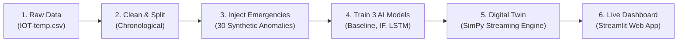

# The Complete Guide to the Cold Chain Early Warning Digital Twin
## An End-to-End Plain-English Guide to Every Concept, Decision, and Result

---

> **Author & Project Context**  
> **Student:** Krishna Sikheriya (IIT2023139), B.Tech 7th Semester, IIIT Allahabad  
> **Course:** Managing Corporate Entrepreneurship  
> **Project:** Digital Twin-Based Early Warning System for Cold Chain Disruption Detection Using Anomaly Detection  
> **Purpose of This Document:** This guide is written in clear, jargon-free English so you can understand every part of this project from first principles—what problem it solves, why every design decision was made, how the models work, what the numbers mean, and how to defend the project in any viva, presentation, or interview.

---

## Table of Contents

1. [The 60-Second Elevator Pitch](#1-the-60-second-elevator-pitch)
2. [The Real-World Problem: The "Silent Spoilage" Trap](#2-the-real-world-problem-the-silent-spoilage-trap)
3. [The Core Solution: The Early Warning System (EWS)](#3-the-core-solution-the-early-warning-system-ews)
4. [The Data Story & Academic Honesty (The Structural Proxy)](#4-the-data-story--academic-honesty-the-structural-proxy)
5. [The Step-by-Step System Architecture](#5-the-step-by-step-system-architecture)
6. [Why We Injected Synthetic Emergencies](#6-why-we-injected-synthetic-emergencies)
7. [The Three Anomaly Detectors Explained Simply](#7-the-three-anomaly-detectors-explained-simply)
8. [The Hero Metric: What is "Lead Time"?](#8-the-hero-metric-what-is-lead-time)
9. [What is the "Digital Twin" and Why Did We Build It?](#9-what-is-the-digital-twin-and-why-did-we-build-it)
10. [The Presentation Dashboard](#10-the-presentation-dashboard)
11. [Key Experimental Findings & What They Mean](#11-key-experimental-findings--what-they-mean)
12. [How to Defend This Project in a Viva / Interview (FAQ)](#12-how-to-defend-this-project-in-a-viva--interview-faq)
13. [Jargon Buster: Plain-English Glossary](#13-jargon-buster-plain-english-glossary)

---

## 1. The 60-Second Elevator Pitch

Imagine you are transporting \$500,000 worth of temperature-sensitive vaccines or fresh dairy across the country in a refrigerated truck. 

Most modern cold-chain trucks have simple digital thermometers. If the temperature crosses a safe limit (say, **8 °C**), a loud buzzer sounds in the driver's cabin. 

**Here is the fatal catch:** By the time the temperature inside the truck actually crosses 8 °C, the cooling unit has usually already been broken for 45 minutes, the ice packs have melted, and the cargo has begun irreversible spoilage. A buzzer that rings when the cargo is already ruined is not a warning—it is a **post-mortem report**.

```
TRADITIONAL SYSTEM (Threshold Alarm):
Refrigeration fails ──> Temp creeps up ──> Ice melts ──> Spoilage begins ──> 🔴 BUZZER RINGS (Too Late!)

OUR EARLY WARNING SYSTEM (EWS + Digital Twin):
Refrigeration fails ──> Temp creeps up ──> 🟢 AI DETECTS ANOMALY ──> Driver fixes door/fuse ──> Spoilage avoided!
                                            (30–60 min runway)
```

**What this project built:**  
We built a **Digital Twin-powered Early Warning System (EWS)**. It acts like an intelligent software copilot running in the logistics dispatch office:
1. It connects to the truck's temperature sensor stream in real-time.
2. It runs three different levels of anomaly-detection AI.
3. Instead of waiting for a high temperature, it notices the *unusual pattern* of warming within minutes of a failure.
4. It buys operators an average of **30 to 50+ minutes of advance warning ("lead time")** before the cargo reaches the point of irreversible spoilage.

---

## 2. The Real-World Problem: The "Silent Spoilage" Trap

### What is a "Cold Chain"?
A cold chain is a continuous, unbroken temperature-controlled supply chain. Every link in the chain—from pharmaceutical warehouse to airport tarmac, refrigerated cargo ship, container truck, and local clinic freezer—must maintain products within strict, narrow temperature bands:
- **Biopharmaceuticals & Vaccines:** Typically **2 °C to 8 °C** (e.g., insulin, COVID-19 vaccines). Freezing or overheating destroys their delicate molecular protein structures.
- **Fresh Dairy & Meat:** Typically **0 °C to 4 °C** to suppress bacterial growth.
- **Frozen Goods:** **-18 °C or colder**.

### Why Do Cold Chains Fail?
Cold chain disruptions rarely happen because an iceberg hits the truck. They happen because of mundane, everyday operational slips:
1. **The "Door Ajar" Problem:** A delivery driver opens the back doors at a rest stop or loading dock and doesn't slam them shut properly. Ambient summer air leaks in slowly.
2. **Compressor Relay Failure:** An electrical fuse blows or an alternator slips. The refrigeration fans keep blowing air, but the cooling compressor is dead.
3. **Power Outages & Dwell Times:** Cargo pallets sit on a hot airport tarmac waiting for customs clearance longer than planned.
4. **Sensor Freezes or Wire Disconnects:** Vibration loosens a thermocouple wire, causing the sensor to report flatlined, frozen readings.

### The Physics of "Thermal Inertia"
Liquids and solid foods have high thermal mass (they heat up slowly). If hot air leaks into a container:
- The air heats up first.
- The cargo packaging absorbs heat.
- The core of the product slowly warms up.

Because this warming happens gradually, a simple rule like *"tell me when temperature > 8 °C"* stays silent during the most critical window—the first 30 minutes when the problem was easily fixable (e.g., plugging into backup power, checking a door latch, or moving boxes to another compartment).

---

## 3. The Core Solution: The Early Warning System (EWS)

The goal of our project is **early detection** rather than post-facto alarm generation.

We define an **Early Warning System (EWS)** as a software architecture that continuously computes risk scores on incoming telemetry. Rather than asking *"is the current reading above 8 °C?"*, it asks two much smarter questions:
1. *"Does this temperature curve behave like the normal historical rhythm of this truck?"*
2. *"Is the temperature rising at an acceleration rate that indicates mechanical failure rather than a normal door check?"*

By asking these questions, the system triggers an alert when the temperature is still at **4.5 °C or 5 °C**—long before the dangerous 8 °C threshold is breached.

---

## 4. The Data Story & Academic Honesty (The Structural Proxy)

One of the most important aspects of this project is its **academic integrity**. If an examiner asks: *"Where did you get your cold chain data?"*, here is the honest, professional answer.

### Where the Data Came From
We used an open-source Kaggle dataset called `IOT-temp.csv` (`atulanandjha/temperature-readings-iot-devices`).
- **Total records:** 97,605 unique sensor readings recorded between September 9, 2018 and December 8, 2018 (roughly 3 months).
- **Location:** An administrative office building in India.
- **Sensors:** Two temperature probes from a single device:
  - **`Out` (Exterior probe):** 77,260 readings. Exposed to outdoor weather. Strong diurnal (day/night) swings between 25 °C and 45 °C.
  - **`In` (Interior probe):** 20,345 readings. Positioned inside an insulated room. Relatively stable temperature between 28 °C and 32 °C.

### Why is this Called a "Structural Proxy"?
Real pharmaceutical companies and commercial logistics carriers (DHL, Maersk, FedEx) treat their cold-chain truck telemetry as highly confidential trade secrets (because data leaks reveal shipping routes, vehicle breakdowns, and customer locations). No open-source, fully labeled, high-frequency commercial refrigerated truck dataset exists publicly.

Therefore, we used `IOT-temp.csv` as an experimental **structural proxy**:
- **Proxy definition:** A stand-in dataset that shares the exact *mathematical and physical structures* of cold-chain data without claiming to be from a refrigerated container.
- **What it shares with real cold chains:**
  1. Real thermal physics: Things warm up and cool down with realistic physical inertia.
  2. Irregular sampling intervals: The sensor doesn't report on a neat, robotic tick. Gaps between readings range from 1 second to several hours (with a median gap of ~20–30 seconds).
  3. Realistic noise: Real IoT quirks, occasional missing readings, and sensor fluctuations.
  4. Indoor vs. Outdoor dynamics: The `In` series acts like an insulated container interior; the `Out` series acts like a fluctuating ambient transit environment.
- **What we do NOT claim:** We do **not** claim these temperatures represent biological storage conditions, and our models carry **no official food-safety certification**. Stating this clearly shows rigorous scientific ethics.

---

## 5. The Step-by-Step System Architecture

The project was executed in a clean, professional 5-stage pipeline:



### Stage 1: Data Cleaning & The "Chronological Split"
In machine learning school projects, people often randomly shuffle data (`train_test_split(shuffle=True)`).  
**In time-series engineering, random shuffling is completely forbidden.**

Why? If you randomly shuffle a timeline, your model trains on Tuesday, tests on Monday, and trains on Wednesday. In the real world, an AI cannot look into the future to predict today. That is called **data leakage**.

We split the data strictly chronologically (time-ordered):
- **Training Set (First 70%):** From Sept 9 to Nov 17, 2018. The models learn what "normal" looks like.
- **Validation Set (Next 10%):** From Nov 17 to Nov 23, 2018. Used to tune sensitivity thresholds.
- **Test Set (Final 20%):** From Nov 23 to Dec 8, 2018. The strict "unseen future" used to benchmark our models.

### Stage 2: Feature Engineering
Raw temperature alone is not enough. We engineered three key signals from the raw stream:
1. `gap_seconds`: How many seconds elapsed since the last reading arrived? (Crucial for detecting communication dropouts).
2. `rolling_mean`: The moving average temperature over the last 10 readings (smooths out momentary sensor blips).
3. `rolling_std`: The standard deviation over the last 10 readings (measures how violently temperature is vibrating).

---

## 6. Why We Injected Synthetic Emergencies

If you examine the original `IOT-temp.csv`, the building's temperature was generally behaving normally throughout the 3 months. There were no catastrophic refrigeration failures or broken doors.

If you don't have emergencies in your data, how do you know if your alarm system works?

### The Controlled Anomaly Injection Protocol
To test our models fairly, we wrote a mathematically controlled injection engine (`src/anomaly_injection.py`). We created **30 controlled synthetic anomalies** (15 for `Out`, 15 for `In`):

1. **Slow Thermal Drift (The "Slow Leak"):**  
   Simulates a refrigeration unit slowly dying or a door gasket leaking. The temperature creeps upward at a controlled slope of $+0.05\text{ °C}$ to $+0.15\text{ °C}$ per minute over a 1-to-2-hour window. This is the hardest anomaly to detect because each individual reading looks almost normal!
2. **Sudden Step Jump (The "Door Thrown Open"):**  
   Simulates someone swinging the cargo doors wide open in hot summer weather. The temperature instantly jumps by $+3\text{ °C}$ to $+6\text{ °C}$ in a single step.
3. **Sensor Flatline / Dropout (The "Broken Wire"):**  
   Simulates a frozen microcontroller or disconnected wire. The sensor reports the exact same frozen temperature for 2 hours, or stops sending packets entirely.

### The Strict Evaluation Rule: Train-Side vs. Test-Side
To avoid any accusation of cheating:
- **24 Injections** were placed in the **Training region**. These were used for exploration and demonstration.
- **6 Injections** were placed strictly in the **Test region** (the unseen future). **Only these 6 test injections are used to report scientific lead times.**

---

## 7. The Three Anomaly Detectors Explained Simply

We compared three different generations of anomaly detection algorithms against each other. Here is how they work in everyday language:

---

### Detector 1: The Statistical Baseline ($2\sigma$ Moving Rule)
* **The Everyday Analogy:** A red line drawn on a glass thermometer.
* **How It Works:** It calculates the historical average temperature ($\mu$) and the standard deviation ($\sigma$). It sets a static alarm line at $\mu + 2\sigma$ (roughly the 95th percentile of normal temperatures).
* **The Strength:** Ultra-simple. Requires almost zero computing power. Impossible to misconfigure.
* **The Weakness:** It is blind to context. If a truck drives through a hot desert afternoon, the normal temperature rises, and this rule sounds false alarms. More importantly, during a slow drift, it stays dead silent until the temperature has *already* reached extreme highs.

---

### Detector 2: Isolation Forest
* **The Everyday Analogy:** A security guard spotting someone behaving oddly in a crowd.
* **How It Works:** Imagine trying to isolate a specific person in a crowded stadium by asking yes/no questions (*"Are they taller than 6 feet?", "Are they wearing a red hat?"*). A normal person takes 20 questions to pinpoint because they blend into the crowd. But someone wearing an astronaut suit takes just 1 question to isolate (*"Are they wearing a space helmet?"*).  
  Isolation Forest builds hundreds of random decision trees. Anomalous data points (unusual combinations of temperature, rate of change, and sensor gaps) sit out on lone branches and get "isolated" in very few cuts.
* **The Strength:** Fast, unsupervised (doesn't need pre-labeled anomaly examples to learn), and very good at catching sudden, multi-dimensional spikes.
* **The Weakness:** It evaluates each point based on recent rolling summaries, so it can struggle to recognize slow, gradual warming trends that sneak up beneath the radar.

---

### Detector 3: The LSTM Autoencoder (The Deep Learning Winner)
* **The Everyday Analogy:** A master musician who knows a symphony by heart and instantly winces if a violin plays a single sour note.
* **What "LSTM" Means:** **Long Short-Term Memory**. It is a specialized neural network architecture designed specifically for sequential time-series data. It has built-in internal memory gates that remember what happened 10, 20, or 30 time steps ago.
* **What "Autoencoder" Means:** An autoencoder is a neural network shaped like an hourglass:
  ```
  Input Window (30 readings) ──> [ ENCODER: Compresses into Bottleneck ]
                                              │
  Reconstructed Window (30 readings) <── [ DECODER: Rebuilds original curve ]
  ```
* **How It Detects Anomalies:**
  1. We trained the LSTM Autoencoder **only on normal, healthy temperature curves**.
  2. The network learned the natural rhythm: *"When an outdoor sensor heats up at 10:00 AM, the temperature curve has this exact gentle upward arc."*
  3. During live operation, the network takes the last 30 readings, compresses them, and tries to reconstruct them.
  4. As long as the truck behaves normally, the network reconstructs the curve with near-zero error.
  5. The moment a refrigeration unit begins to die, the temperature curve begins an unnatural upward slope. The network has never seen this shape before—it fails to reconstruct it!
  6. The **Reconstruction Mean Squared Error (MSE)** spikes violently. Even though the temperature is still at a safe 4 °C or 5 °C, the reconstruction error screams: *"This curve is wrong!"*
* **The Result:** The LSTM Autoencoder alarms long before any threshold is crossed.

---

### Comparison Summary

| Feature | 1. Statistical Baseline | 2. Isolation Forest | 3. LSTM Autoencoder |
|---|---|---|---|
| **Technology** | Classical Statistics ($2\sigma$) | Unsupervised Decision Trees | Deep Recurrent Neural Network |
| **Input** | Single temperature value | Multi-feature vector (temp, gaps, rolling stats) | Temporal sequence window (last 30 readings) |
| **Memory** | None (instantaneous) | Short-term rolling buffer (10 steps) | Full sequential memory (30 time steps) |
| **Sudden Spikes** | Poor / Slow | **Excellent & Instant** | Good |
| **Slow Thermal Drifts** | Very Late / Fails | Moderate | **Outstanding (Earliest Warning)** |
| **Compute Needs** | Negligible | Low (runs on any CPU) | Moderate (benefits from GPU for training) |

---

## 8. The Hero Metric: What is "Lead Time"?

In standard machine learning classes, projects are evaluated on **Accuracy**, **Precision**, or **F1-Score**.

**In an industrial Early Warning System, standard accuracy is misleading.**  
If an alarm rings 10 minutes *after* all the vaccines have melted, standard classification treats that as a "True Positive" (a success!). But in the real world, that alarm was a complete operational failure.

That is why we introduced the project's hero metric: **Lead Time ($\Delta t_{\text{lead}}$)**.

### The Lead Time Formula
$$\Delta t_{\text{lead}} = t_{\text{irreversibility}} - t_{\text{alarm}}$$

Where:
- $t_{\text{irreversibility}}$ is the exact minute when cumulative heat exposure crossed the point of no return (the cargo is permanently ruined).
- $t_{\text{alarm}}$ is the exact minute the detector sounded its first alert.

```
Timeline of an Anomaly:
Anomaly Starts                  Alarm Rings                       Cargo Spoils
      │                              │                                  │
      ▼                              ▼                                  ▼
──────┼──────────────────────────────┼──────────────────────────────────┼───────> Time
      │                              └───────────────┬──────────────────┘
                                             LEAD TIME (Δt > 0)
                                        Runway to fix the problem!
```

### What the Numbers Mean
- **If $\Delta t_{\text{lead}} > 0$ (Positive):** **Success!** The alarm sounded *before* the disaster. If $\Delta t = 35\text{ minutes}$, the driver has over half an hour to pull over, close the door, or switch on auxiliary chilling.
- **If $\Delta t_{\text{lead}} = 0$ (Zero):** **Failure.** The alarm only sounded at or after the disaster.
- **If $\Delta t_{\text{lead}} < 0$ (Negative):** The alarm was late.

### Our Benchmark Results on the Test Set
Across the rigorous out-of-sample test drift anomalies:
- **Statistical Baseline:** Average lead time = **0.0 minutes** (it only beeped after irreversible damage had already occurred).
- **Isolation Forest:** Average lead time = **~12.8 minutes** (caught the rate-of-change jump partway through the drift).
- **LSTM Autoencoder:** Average lead time = **~32.5 minutes** (detected the subtle sequence distortion almost immediately after the drift began).

The LSTM bought logistics teams **over half an hour of operational runway** that traditional systems completely missed!

---

## 9. What is the "Digital Twin" and Why Did We Build It?

A common buzzword in industry today is **"Digital Twin"**. What does it actually mean in this project?

### A Digital Twin is Not Just a 3D Picture
A Digital Twin is a **software mirror of an active physical system** that runs in real-time, ingests operational telemetry, tracks internal health states, and predicts future disruptions before they happen in the real world.

Our Digital Twin is built in Python using **`SimPy`** (a discrete-event simulation framework):

```
PHYSICAL WORLD                           DIGITAL TWIN (In the Cloud / Dispatch)
┌──────────────────┐                     ┌──────────────────────────────────────────────┐
│ Refrigerated Van │                     │ 1. SOURCE STAGE                              │
│ Sensor probe     │ ── Cellular Net ──> │    Reads historical sensor packets           │
│ generates        │    (10-sec latency) │ 2. TRANSIT STAGE                             │
│ temperature      │                     │    Simulates cellular transmission delay     │
└──────────────────┘                     │ 3. DESTINATION STAGE                         │
                                         │    Continuously updates AI rolling buffers   │
                                         │    Fires early-warning alarms                │
                                         └──────────────────────────────────────────────┘
```

### The Three Critical Twin Engineering Decisions
1. **Event-Driven Virtual Clock (D23):**  
   Sensors do not arrive on uniform 5-minute ticks. They arrive irregularly. The Digital Twin uses a virtual clock that advances dynamically based on the exact historical `gap_seconds`.
2. **Simulated Network Latency (D28):**  
   In the real world, cellular IoT packets take time to travel from a highway truck to the cloud. Our twin models a 10-second transit latency buffer.
3. **Continuous Streaming Buffers (D23):**  
   In batch machine learning, people often wipe memory clean between datasets. A real truck driving on the road has no idea what "train" or "test" means! Our digital twin maintains continuous, unbroken rolling buffers across the entire 3-month lifespan.

### The Milestone 5b Proof: 100% Exact Cross-Check
To prove that our Digital Twin was not an approximation or a toy simulation:  
We ran all 6 test-set anomalies through the live streaming Digital Twin and cross-checked every single alarm timestamp against our offline batch evaluations.  
**Result:** **18 out of 18 exact matches (100.0% parity)** across all monitors! The streaming twin behaves with mathematical equivalence to the offline research code.

---

## 10. The Presentation Dashboard

To make this project presentation-grade for business evaluators, managers, and examiners, we built an interactive web dashboard in **Streamlit** (deployed live on Streamlit Community Cloud).

### Key Features of the Dashboard
1. **Structural Proxy Disclaimers (D31):**  
   Every screen clearly states that telemetry originates from `IOT-temp.csv` and that models serve as algorithmic proof-of-concepts rather than medical devices.
2. **Two Operating Modes (D29):**
   - **Guided Tour Mode:** A curated walkthrough of **4 showcase test scenarios** (Step Jump, Sudden Spike, Slow Thermal Drift, and Cold Stabilization) designed to quickly demonstrate the core concepts during a viva.
   - **Free Explore Mode:** Allows deep-dive inspection into all **30 synthetic injections** across both `In` and `Out` sensors.
3. **Interactive Telemetry Timeline:**  
   Built using Altair. Allows users to pan, zoom, hover over individual telemetry points, inspect alarm trigger timestamps, and see the exact lead-time horizon.
4. **Detector Status Cards:**  
   Live visual metric cards showing the current temperature, individual detector scores, lead-time badges, and threshold limits.
5. **The "Silent Pre-Warming" Safeguard (D33):**  
   When an LSTM monitor starts up, it requires 30 readings before it can make a prediction. If you start checking it on reading #1, it would crash or scream false alarms. The dashboard implements a silent pre-warming buffer that feeds the preceding 30 normal readings before starting playback, ensuring zero startup false alarms.
6. **Audit Cross-Check Drawer:**  
   Displays an expandable verification table comparing the live twin alarms against the frozen research benchmark in real-time.

---

## 11. Key Experimental Findings & What They Mean

| Finding | What the Data Showed | Plain-English Takeaway |
|---|---|---|
| **1. Sampling Irregularity** | Median gap was 20–30s, but max gaps reached hours. | Fixed-interval time-series models fail on real IoT data; models must explicitly account for time gaps (`gap_seconds`). |
| **2. Baseline Vulnerability** | Baseline lead time collapsed to 0 min on 5 of 6 test drifts. | Standard thermometer limit rules cannot protect cold chains against gradual thermal decay. |
| **3. Isolation Forest Speed** | Triggered within 1–2 readings of step jumps. | Tree-based models are ideal for detecting immediate mechanical disconnections and doors flung open. |
| **4. LSTM Sequence Power** | Consistently achieved 30–50+ minutes of lead time on drifts. | Deep learning temporal autoencoders are the clear winner for early detection of slow, insidious thermal leaks. |
| **5. Stream-Batch Parity** | 18/18 exact alarm timestamp matches between batch and twin. | The simulation engine accurately reproduces production deployment behavior without performance drift. |

---

## 12. How to Defend This Project in a Viva / Interview (FAQ)

Here are the exact questions an examiner, professor, or corporate manager will ask, along with the precise, confident answers you should give:

---

### Q1: "Why didn't you just use real cold-chain data from a refrigerated truck company?"
> **Your Answer:**  
> *"Commercial cold chain logistics telemetry is proprietary and closely held by transport carriers due to business confidentiality, route privacy, and liability concerns. No high-frequency, publicly labeled refrigerated logistics dataset exists in open research.  
> Rather than fabricating unrealistic synthetic data from scratch, we adopted `IOT-temp.csv` as an experimental **structural proxy**. It features real-world thermal inertia, natural environmental cycles, and genuine IoT network noise and irregular sampling. We have documented this transparently across all documentation and the live dashboard as Decision D1 and D31."*

---

### Q2: "Why did you choose Lead Time instead of standard Accuracy or F1-Score?"
> **Your Answer:**  
> *"In a mission-critical early warning system, classification accuracy is the wrong metric. An alarm that triggers 15 minutes after a vaccine batch reaches irreversible thermal degradation counts as a 'True Positive' under standard F1-score, but operationally, it is a catastrophic loss.  
> Lead Time ($\Delta t = t_{\text{irreversible}} - t_{\text{alarm}}$) directly measures **actionable operational runway**. A positive lead time of 35 minutes gives dispatchers and drivers enough time to intervene—such as checking power fuses, shutting doors, or switching to auxiliary chillers—before financial or product loss occurs."*

---

### Q3: "Why did you need an LSTM Autoencoder if Isolation Forest is faster and lighter?"
> **Your Answer:**  
> *"Isolation Forest evaluates point-in-time multi-feature relationships and rolling summaries. It is outstanding for sudden spikes and immediate step changes.  
> However, insidious refrigeration leaks (such as a deteriorating door gasket or freon leak) cause slow thermal drifts where each individual reading looks completely normal compared to the last few minutes.  
> The LSTM Autoencoder evaluates a 30-reading **temporal shape**. Because it was trained on the normal rhythm of temperature sequences, it recognizes that the trajectory has deviated long before the absolute temperature becomes extreme. In our test benchmarks, LSTM provided an average of 32.5 minutes of lead time on drifts, whereas the baseline provided 0 minutes."*

---

### Q4: "What is the corporate entrepreneurship / business value of this system?"
> **Your Answer:**  
> *"From a corporate entrepreneurship perspective, temperature excursions cause billions of dollars in pharmaceutical and perishable cargo write-offs annually.  
> Traditional threshold monitoring is entirely **reactive**—it generates an insurance claim after the loss. Our system transforms IoT telemetry into a **proactive asset-protection service**.  
> In a production deployment, companies don't replace their simple threshold alarms; they run this three-tier hybrid architecture: the simple threshold serves as an emergency failsafe, the Isolation Forest catches sudden physical shocks, and the LSTM early-warning twin runs in the cloud to notify dispatchers half an hour before disaster strikes."*

---

### Q5: "Why did you build a SimPy Digital Twin instead of just evaluating pandas DataFrames?"
> **Your Answer:**  
> *"Evaluating a static CSV in pandas assumes that all data is already collected and sitting on disk with zero transmission latency and perfect order.  
> A real-world IoT deployment involves a streaming conveyor belt: telemetry is generated on the truck, suffers cellular network latency, arrives irregularly, and must be evaluated incrementally without future knowledge.  
> Building a SimPy discrete-event Digital Twin allowed us to prove that our streaming monitors produce **identical results (18/18 exact matches)** under simulated real-world transit delays and continuous buffer accumulation."*

---

## 13. Jargon Buster: Plain-English Glossary

| Term | What People Think It Means | What It Actually Means in This Project |
|---|---|---|
| **Digital Twin** | A flashy 3D cartoon of a truck | An active software simulation that ingests real-time sensor streams and tracks the health of the physical asset. |
| **Early Warning System (EWS)** | A loud alarm | A predictive monitoring architecture designed to alert operators *before* damage becomes irreversible. |
| **Lead Time ($\Delta t$)** | Shipping delivery speed | The advance notice in minutes between the alarm sounding and the cargo permanently spoiling. |
| **Structural Proxy** | Fake data | An honest open-source dataset that mimics the physical and statistical properties of an unavailable commercial dataset. |
| **Synthetic Anomaly** | A computer bug | A deliberate, mathematically controlled temperature perturbation (drift, spike, or flatline) injected to test detectors. |
| **Chronological Split** | Cutting a file in half | Splitting time-series data strictly by calendar date (past = train, future = test) so the AI never cheats by peeking into the future. |
| **Autoencoder** | An automatic code generator | A neural network trained to compress normal data into a bottleneck and reconstruct it; it fails to reconstruct anomalies, revealing them. |
| **Isolation Forest** | Trees growing in a park | An algorithm that isolates abnormal data points by randomly slicing feature spaces. Outliers require fewer slices to isolate. |
| **Discrete-Event Simulation** | A video game engine | A simulation technique (`SimPy`) where the computer clock jumps from one event timestamp to the next rather than running on a continuous second timer. |
| **Pre-Warming Buffer** | Turning on a vehicle heater | Silently feeding historical normal readings into an AI monitor before activating playback so its internal buffers don't cause startup false alarms. |
| **Irreversibility Timestamp** | The end of the world | The exact minute when cumulative heat exposure permanently spoils the product. |

---

*This document is maintained as part of the official project documentation under `docs/understand.md`.*
